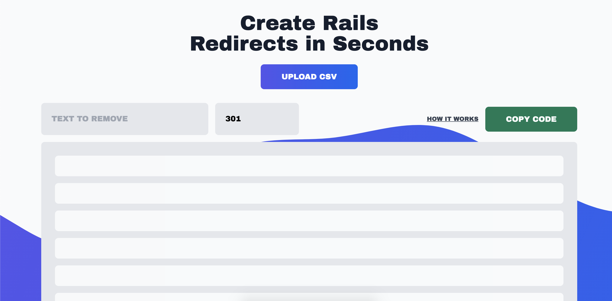

## Reason

Easily, once a week I will recieve a CSV of 301 or 500 redirects from marketing for a website we've worked or are working on. The process of uploading these redirects is tiresome.

## Solution

Create a CSV parsing website that will generate Ruby on Rails redirects that can be dropped in to the app.

## Product

Landing page where users can upload a CSV and configure the redirects.
