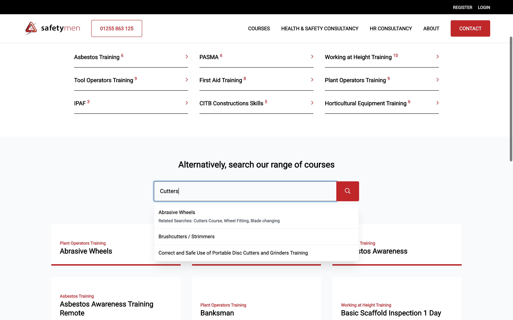
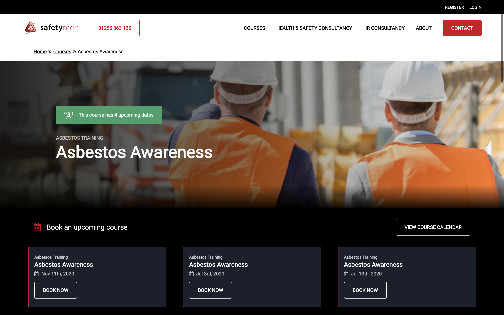
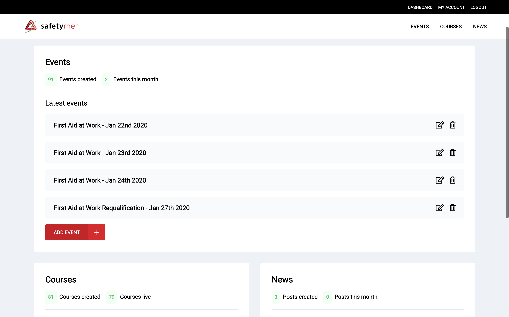
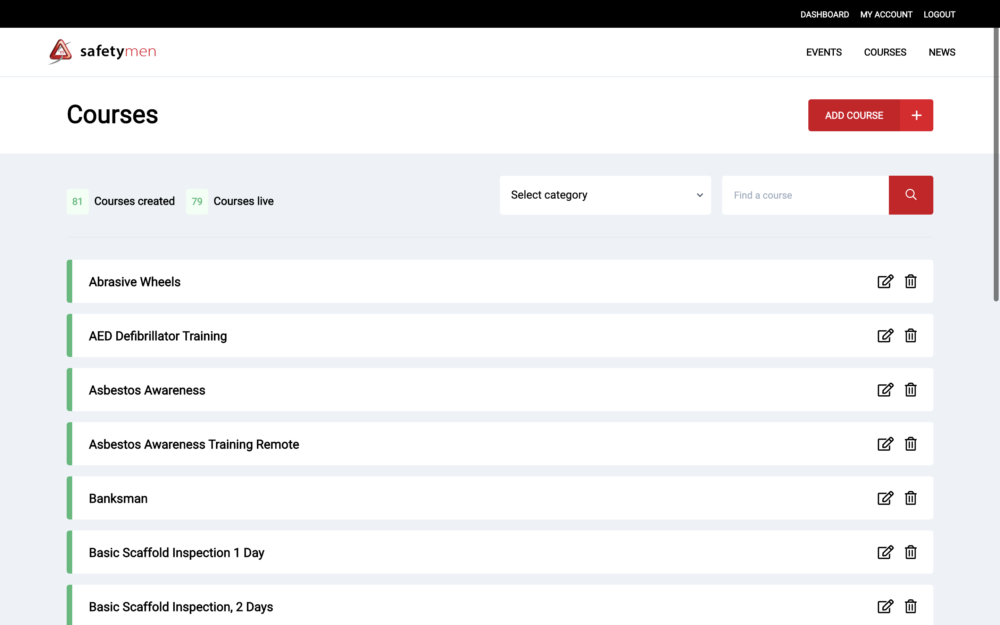
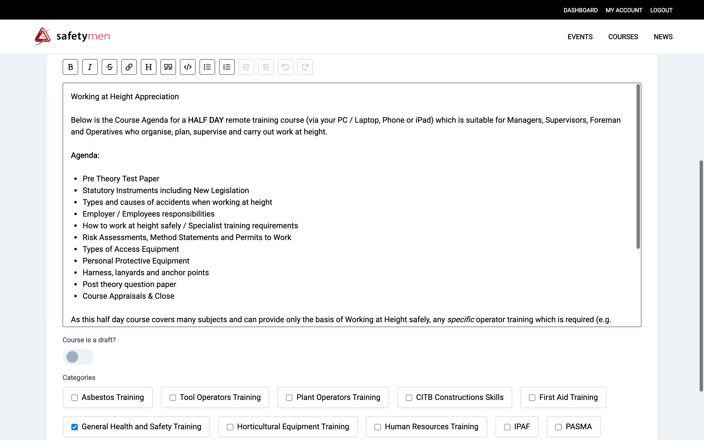

## The challenge

The client wanted to automate the whole courses process for themselves and the customers.

## The solution

- Build out a CRUD app with Ruby on Rails for courses
- Create a custom admin area to manage courses
- Implement Stripe payment and courses booking for customers
- Add autofill search where courses have multiple search terms

## What we built

Shows upcoming courses that are bookable below the banner.

Custom search implemented with [StimulusJS](https://stimulusjs.org/) with JSON data supplied from Rails.

Individual courses that showcase off the courses info, as well as upcoming bookable courses.

An admin dasboard to manage courses, news and bookable courses (events).

Courses view in the admin dashboard with pagination, category filtering and search.

Individual course form with WSYIWYG editor built from [Trix](https://trix-editor.org/).
